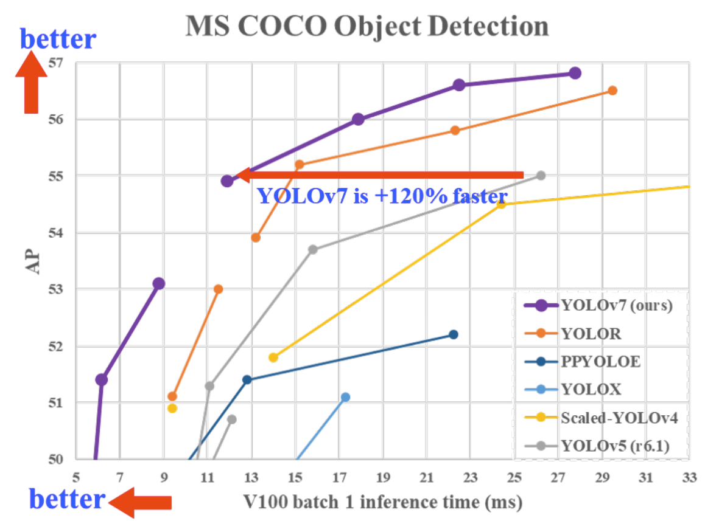

<div align="center">
<h2>
  Yolov7-Pip: Packaged version of the Yolov7 repository  
</h2>
<h4>
    
</h4>
<div>
    <a href="https://pepy.tech/project/yolov7detect"></a>
    <a href="https://badge.fury.io/py/yolov7detect"></a>
    <a href="https://huggingface.co/spaces/kadirnar/yolov7"></a>
</div>
</div>

## <div align="center">Overview</div>

This repo is a packaged version of the [Yolov7](https://github.com/WongKinYiu/yolov7) model.
### Installation
```
pip install yolov7detect
```

### Yolov7 Inference
```python
import yolov7

# load pretrained or custom model
model = yolov7.load('yolov7.pt')
#model = yolov7.load('kadirnar/yolov7-v0.1', hf_model=True)

# set model parameters
model.conf = 0.25  # NMS confidence threshold
model.iou = 0.45  # NMS IoU threshold
model.classes = None  # (optional list) filter by class

# set image
imgs = 'inference/images'

# perform inference
results = model(imgs)

# inference with larger input size and test time augmentation
results = model(img, size=1280, augment=True)

# parse results
predictions = results.pred[0]
boxes = predictions[:, :4] # x1, y1, x2, y2
scores = predictions[:, 4]
categories = predictions[:, 5]

# show detection bounding boxes on image
results.show()
```
### Citation
```bibtex
@article{wang2022yolov7,
  title={{YOLOv7}: Trainable bag-of-freebies sets new state-of-the-art for real-time object detectors},
  author={Wang, Chien-Yao and Bochkovskiy, Alexey and Liao, Hong-Yuan Mark},
  journal={arXiv preprint arXiv:2207.02696},
  year={2022}
}
```
### Acknowledgement
A part of the code is borrowed from [Yolov5-pip](https://github.com/fcakyon/yolov5-pip). Many thanks for their wonderful works.
